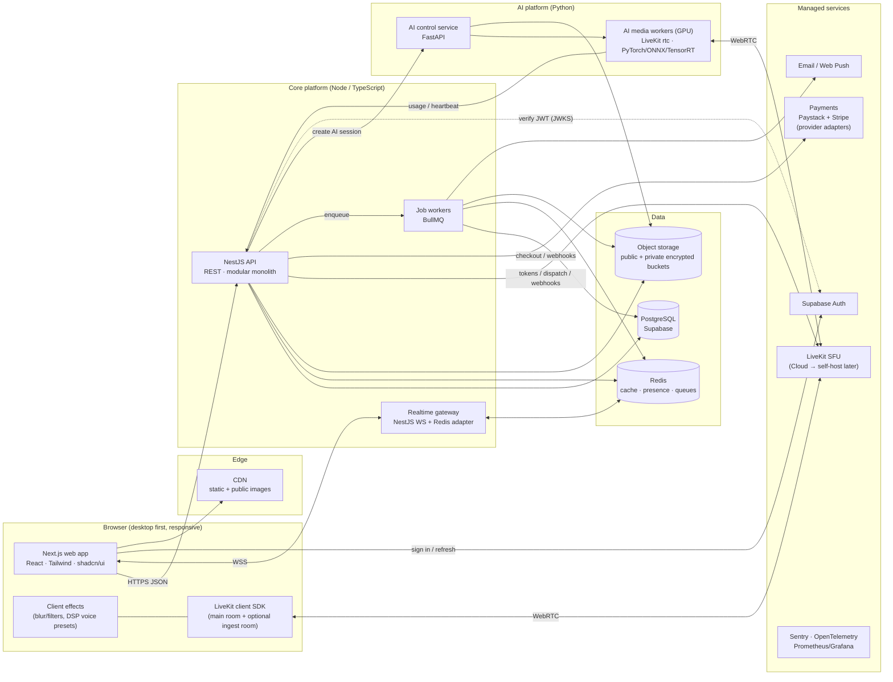
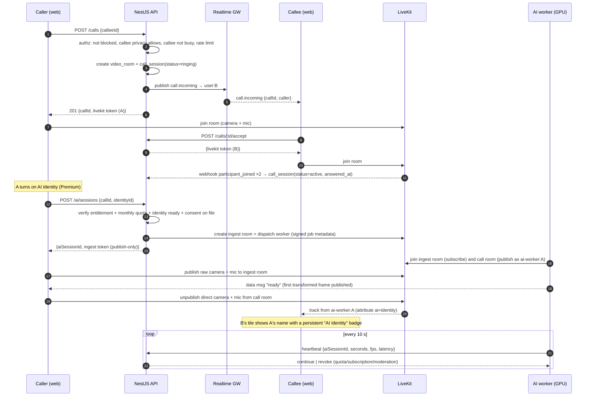
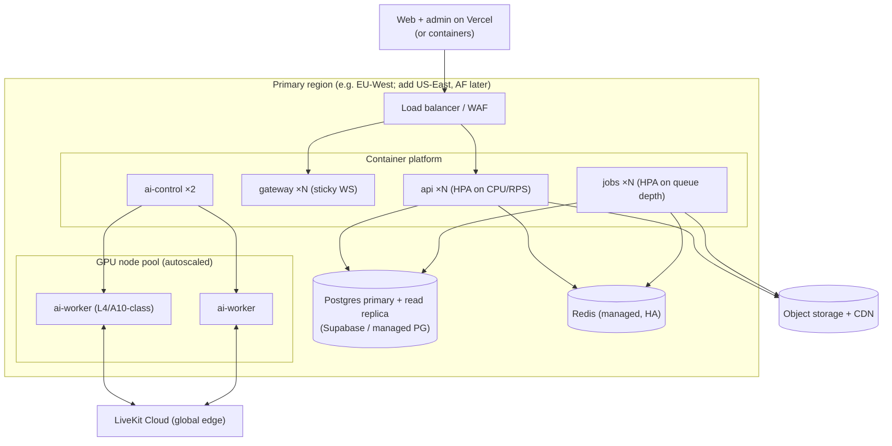

# 01 — System Architecture

## 1. Component diagram

### Responsibilities

| Component | Owns | Does **not** own |
|-----------|------|------------------|
| **Web (Next.js)** | UI, routing, server components for public/SEO pages (landing, public profiles), LiveKit client, client-side effects | Business rules, entitlement decisions, direct DB writes |
| **API (NestJS)** | Users, profiles, social graph, calls and room authorization, LiveKit token minting, billing and entitlements, identity/voice metadata, uploads, moderation, admin, webhooks | Media processing, long-lived sockets |
| **Realtime gateway** | WebSocket fan-out: incoming call ringing, message delivery, typing, presence, notification push | Persistence (it calls domain services, which write) |
| **Job workers** | Async work: image scanning/validation, email, notification fan-out, webhook processing, ringing timeouts, retention purges, analytics rollups | Anything a user is waiting on synchronously |
| **AI control (FastAPI)** | Identity/voice preparation (face validation, embedding extraction, voice model prep), worker registry and health, model versioning | Auth, billing (it trusts only API-signed requests) |
| **AI media workers** | Real-time face and voice transformation for one session each, per-frame disclosure watermark, usage heartbeats | Anything outside the session they were dispatched for |
| **LiveKit** | SFU, TURN, simulcast, bandwidth estimation, recording/egress, webhooks | User identity (it trusts API-minted JWTs) |
| **Supabase** | Postgres hosting, Auth (email/password, OAuth, MFA), optionally Storage | Authorization for app data. Every write goes through the API; RLS is deny-by-default as a second line of defence |

## 2. Key data flows

### 2.1 Start a 1-to-1 call (with an AI identity turned on mid-call)

### 2.2 Premium purchase

`POST /subscriptions/checkout` → payment provider hosted checkout → provider webhook (signature verified, stored idempotently in `webhook_events`) → job worker upserts `subscriptions`, `payments` and `payment_transactions` → entitlement cache for the user is invalidated → gateway pushes `entitlements.updated` → UI unlocks. **The redirect back from checkout never grants anything**; only the webhook does. The success page polls `GET /me/entitlements` until the change arrives.

### 2.3 Identity upload

(Premium only: every step re-checks `PREMIUM_ACTIVE`, 05 §3.) Client asks `POST /identities/uploads` → gets a short-lived signed upload URL for a **private quarantine** bucket (content-type and size are fixed in the signature) → uploads directly → `POST /identities` with the upload id, a name and the consent attestation → job: magic-byte check, re-encode (strips EXIF/metadata and any polyglot payload), malware scan, face validation via AI control (exactly one face, minimum size, pose/blur/lighting scores, minor-likelihood and sexual-content hard blocks, 05 §7.1) → source image and model-specific prepared asset stored encrypted in the user's data-region bucket → `identities.status = ready` → notification. Rejections return a specific, user-friendly reason code (see 06 §6).

## 3. Stack decisions and trade-offs

The brief's stack is kept. The additions and clarifications below are the "strong technical reasons" the brief asks for.

| Area | Decision | Why / trade-off |
|------|----------|-----------------|
| Monorepo | **pnpm + Turborepo**: `apps/web`, `apps/admin`, `apps/api`, `services/ai`, `packages/ui`, `packages/contracts`, `packages/config` | One PR can change the API contract and its UI. Python lives alongside with its own toolchain (uv) |
| Admin UI | **Separate Next.js app on its own subdomain** | Separate cookie scope, stricter CSP, can sit behind an IP allowlist or zero-trust proxy, and no admin code ships in the user bundle |
| Backend shape | **NestJS modular monolith, three deployables from one codebase** (api, gateway, jobs) | Microservices on day 1 would add a lot of operational cost and no user value. Module boundaries are enforced with lint rules, so extracting a module later is mechanical |
| ORM / migrations | **Drizzle ORM + plain SQL migrations** | Postgres-first: partial indexes, CHECKs, citext, RLS and triggers stay in reviewed SQL. Typed queries without Prisma's engine overhead. *Alternative:* Prisma, if the team already knows it |
| Contracts | **Zod schemas in `packages/contracts` → NestJS validation + OpenAPI → generated TS client** | One source of truth. The frontend cannot drift from the API |
| Auth | **Supabase Auth**: the API verifies access tokens with JWKS (asymmetric keys) and roles live in our DB | Avoids building password reset, OAuth, MFA and email verification ourselves. The API never trusts role or premium claims in the token |
| Realtime | **Own NestJS WebSocket gateway** (socket.io + Redis adapter) rather than Supabase Realtime | Authorization for ringing, typing and presence must live in our code. *Alternative for speed:* Supabase Realtime Broadcast in Stage 7 if the gateway is behind schedule |
| In-call chat | Same DM conversation, shown in the call side panel (not LiveKit data channels) | History survives the call and "chat → call → chat" stays continuous. Latency is fine for text |
| Queues | **Redis + BullMQ** | Delayed jobs (ring timeouts), retries, rate-limited fan-out. Upgrade to a broker such as NATS only if needed |
| Video | **LiveKit Cloud at launch, self-hosted LiveKit later** | Cloud gives global edge and TURN on day 1. Self-hosting becomes cheaper at scale. The code is identical |
| AI worker dispatch | **LiveKit Agents framework (Python)** for worker registration, explicit dispatch and load reporting, with FastAPI as the control plane | LiveKit already solves "send this room job to a free worker near the SFU". Building our own Redis scheduler would duplicate it |
| Payments | **Paystack + Stripe from day one, behind a `PaymentProvider` interface** ([08](08-payments.md)). The platform keeps its own subscription state (`PREMIUM_ACTIVE` …). Providers only report events | D1: Nigerian company, local and international customers. Adding a provider later is one adapter plus price rows. Eligibility and recurring support to be verified per provider during implementation |
| Storage | **S3-compatible object storage.** Public bucket behind the CDN for avatars/thumbnails; **private, encrypted buckets** for identity images, embeddings and voice data | Biometric-like data needs its own keys, stricter IAM and a separate retention policy |
| Free effects | **Client-side** (LiveKit track processors: background blur/replace, simple filters, DSP pitch presets) | Zero GPU cost, zero added latency, fully private. The free tier stays generous without cost risk |
| Observability | Sentry (web, API, AI), OpenTelemetry traces, Prometheus + Grafana, structured JSON logs | GPU fps/latency and call quality are first-class product metrics |

## 4. Deployment architecture

| Environment | Purpose | Notes |
|-------------|---------|-------|
| `local` | Development | docker-compose: Postgres, Redis, LiveKit dev server, MinIO, Mailpit. AI worker runs on a local NVIDIA GPU or a dev GPU box |
| `staging` | Pre-production, mirrors prod topology at small scale | Stripe/Paystack test mode, LiveKit Cloud project, one GPU node |
| `production` | Live | Separate cloud accounts/projects, separate secrets, no shared databases |

**CI/CD (GitHub Actions):** lint → typecheck → unit tests → contract tests (OpenAPI diff) → build images → integration tests against ephemeral Postgres/Redis/LiveKit → deploy to staging → Playwright E2E (auth, call with two fake-media browsers, checkout in test mode) → manual promotion to prod. DB migrations run as a gated job before rollout and must be backwards-compatible (expand → migrate → contract). AI worker images are versioned together with their model versions.

**Hosting path:** start with a managed container platform (Fly.io, Render, AWS ECS or GCP) for Node and one or two rented GPU servers for AI. Move to Kubernetes with a GPU node pool when AI concurrency needs autoscaling (roughly more than 20 concurrent AI sessions). Infrastructure as code (Terraform) from staging onward.

## 5. Scalability plan

| Scale | What changes |
|-------|--------------|
| **≤10k users** | 2 API, 2 gateway, 1–2 job pods. Single Postgres + pooler. LiveKit Cloud. 1–3 GPU workers |
| **≤100k users** | Read replica for discovery/profile reads. Redis cache for profiles and entitlements. CDN image transforms. GPU autoscaling on active-session count. Messages/notifications partitioned by month. Search moves to Postgres FTS + trigram, or Meilisearch/Typesense if relevance needs it |
| **1M+ users** | Multi-region API and GPU pools pinned near LiveKit regions. Evaluate self-hosted LiveKit for cost. Messaging extracted into its own service, with Postgres-partitioned or ScyllaDB storage if write volume demands it. Dedicated analytics store (ClickHouse) fed by events. Recommendations become an offline batch job |

Stateless everything except Postgres, Redis and object storage. Presence and "is in a call" state live in Redis with TTL heartbeats, never in Postgres.

## 6. Bottlenecks and risks (engineering view)

| # | Bottleneck | Impact | Mitigation |
|---|-----------|--------|------------|
| 1 | **GPU capacity for face transformation** | Every AI minute costs real money. Capacity per GPU is unknown until benchmarked | Stage 4 benchmark harness. Admission control ("AI busy, try again" state). Monthly AI-minute quotas per plan. Scale to zero overnight |
| 2 | **Added latency on the AI path** (extra SFU hop + inference + encode) | Conversation feels laggy above ~300 ms glass-to-glass | Worker co-located with the LiveKit region. GPU decode/encode where possible. Face tracking with re-detection every N frames. Latency budget enforced in CI benchmarks (02 §4) |
| 3 | **A/V sync** when video and audio take different paths | Lip-sync drift | Route audio through the worker whenever the identity is on; publish A/V from one participant via a synchronizer |
| 4 | **Commercial licensing of face/voice models** | May block launch of the flagship feature | License review gate per model. Budget for a licensed SDK or a proprietary model. Stylized-avatar fallback product |
| 5 | Ringing/presence fan-out | Gateway hot keys for popular creators | Redis adapter, per-user rooms, presence throttled to changes only |
| 6 | Discovery queries | Expensive filtered sorts | Precomputed candidate sets, keyset pagination, indexes (03), cache |
| 7 | Webhook storms (billing, LiveKit) | Duplicate processing | Idempotency table and queue-based processing, never inline |
| 8 | LiveKit participant-minute costs | AI calls use about 2× the participant-minutes (ingest room + worker) | Ingest room holds only the user and the worker. Low-res simulcast layer disabled on ingest. Monitor cost per AI minute |
| 9 | Abuse of face/voice transformation (fraud, impersonation) | Legal and trust risk | Rights attestation, hard blocks for minors/sexual content, enforced disclosure, watermarking, reporting tied to AI sessions, rate limits on new identities (05 §7) |

## 7. Global users and regional data (D2)

The product is global from day one while the company operates from Nigeria. The architecture lets per-market legal requirements be met **later, without a rewrite**:

| Concern | Day-one design | Later, if a market requires it |
|---------|----------------|--------------------------------|
| Where sensitive data lives | `users.data_region` set at sign-up from country (default `global`). Identity/voice objects are stored in a **bucket selected by `data_region`** (one bucket per region from day one, even if all sit in one cloud region at first) | Move a region's bucket into an in-region cloud location. Only config changes |
| Where AI processing happens | Worker dispatch filtered by the region of the call's LiveKit node **and** allowed-region rules for the user's `data_region` | GPU pools in-region (e.g. EU-only processing for EU users) |
| Relational data | Single primary Postgres. All tables keyed by `user_id` | "Cell" deployment: a regional stack (API + DB + storage + GPU) per data region, with a thin global directory for login routing and cross-region discovery |
| Feature availability | `country_feature_flags` checked in entitlement resolution (03 §3) | Launch a market with AI features off until its legal review is done (05 §9) |
| Payments | Provider and currency chosen per user (08 §3) | Add local providers per region |
| Localisation | UI strings through i18n from Stage 1 (English first). Dates, currencies and numbers via `Intl` | Additional languages, RTL support |

Cross-region calls (e.g. a user in Lagos calling a user in London) are normal. LiveKit Cloud routes media via the nearest edges, and each user's AI processing follows their own region rules.
