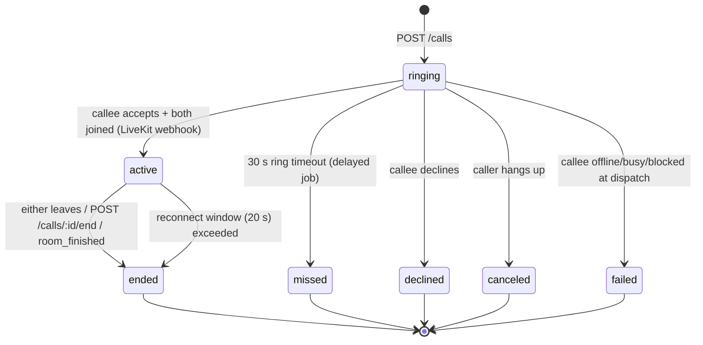
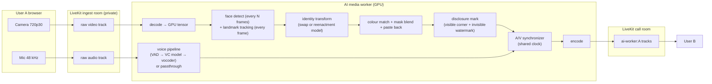

# 02 — Video Rooms & AI Media Pipeline

## 1. Video room architecture

### 1.1 Room types

| `video_rooms.type` | LiveKit room name | Participants | Lifetime |
|--------------------|-------------------|--------------|----------|
| `call` | `call_<uuid>` | 2 now, ≤8 in the group-call phase, plus `ai-worker:*` participants | Created on `POST /calls`, closed on end, `empty_timeout` 30 s |
| `ai_ingest` | `ingest_<uuid>` | Exactly one user (publish-only) and one AI worker (subscribe-only) | One per AI session |
| `livestream` | `live_<uuid>` | Host, co-hosts and moderators publish; viewers subscribe only | Stage 9 |

Room names are opaque UUIDs. No usernames appear in room names or in LiveKit identities.

### 1.2 LiveKit identities and token grants

Only the API mints tokens. Token TTL is **10 minutes**. The token is needed only to connect, and LiveKit refreshes it for connected participants.

| Identity | Room | Grants |
|----------|------|--------|
| `u:<userId>` | call | `roomJoin`, `canPublish` (sources: camera, microphone, screen_share, screen_share_audio), `canSubscribe`, `canPublishData` |
| `u:<userId>` | ingest | `roomJoin`, `canPublish` (camera, microphone), **`canSubscribe: false`** |
| `ai-worker:<userId>:<aiSessionId>` | ingest | `canSubscribe`, **no publish** |
| `ai-worker:<userId>:<aiSessionId>` | call | `canPublish` (camera, microphone), `canSubscribe: false` (does not need the other side), participant attributes `{"ai":"identity"\|"voice"\|"identity+voice","for":"<userId>"}` |
| `viewer:<userId>` | livestream | `canSubscribe` only |

Clients render participants by `for`/`userId`, so the remote sees one tile for the user whether the media comes from `u:` or `ai-worker:`. **The `ai-worker:` prefix is reserved.** The API rejects any request that would mint a token with it outside an AI session. That is what makes the disclosure badge trustworthy (05 §6).

### 1.3 Call lifecycle (state machine)



- **Durations come from LiveKit webhooks** (`participant_joined` / `participant_left` / `room_finished`), not from client timers. The client timer is display only.
- **Glare** (A and B call each other at the same moment): the API holds a per-pair Redis lock. The second `POST /calls` returns the existing ringing call, and the UI auto-accepts it.
- **Busy:** `presence:<userId>.inCall` in Redis. Call waiting is out of scope for the MVP.
- **Reconnect:** LiveKit handles ICE restarts. The UI shows a "Reconnecting…" overlay (06 §5). If the user is gone for more than 20 s the server ends the call with `end_reason=network`.
- **Call summary:** on `ended`, the API computes duration, AI features used (from `ai_processing_sessions`) and a quality summary (client-reported stats), and the UI shows the summary sheet with "Call again", "Message" and "Report".

### 1.4 Quality settings

- 720p30 camera with simulcast (180p/360p/720p) in the call room. Adaptive stream + dynacast on.
- **Ingest room: single 720p layer, no simulcast**. Only the worker subscribes, and it needs the best frame.
- Opus with DTX and FEC for mic. Screen share at 1080p/15fps (text) or 720p/30 (motion).
- Client stats (`getStats`: RTT, jitter, packet loss, fps) are sampled every 5 s → connection-quality chip in the top bar + a quality summary posted at call end.

## 2. Where AI runs: options considered

| Option | Latency | Quality | Cost | Privacy | Verdict |
|--------|---------|---------|------|---------|---------|
| **A. In the browser** (WebGPU / ONNX Runtime Web) | Lowest | Limited by user hardware. Laptops without a good GPU can't sustain a 30 fps transform | Free for us | Best | **Use for free, non-AI effects only** (background blur/replace). Also a candidate for the *stylized* track (§5, Track C) and for Premium DSP voice. **Premium checks still happen on the server**: client-side Premium effects are only enabled by a server-issued, short-lived signed capability, and they are a convenience, not the security boundary |
| **B. Server GPU worker as a LiveKit participant** | +60–120 ms (target) | Consistent, independent of device | GPU-hours | Raw media leaves the device to our worker (never to the peer) | **Chosen for Premium face and neural voice** |
| C. Desktop app / virtual camera | Low | High | Free for us | Good | Not a web platform. Would also bypass our disclosure guarantees |

## 3. AI media pipeline (Option B)

### 3.1 Topology



### 3.2 Face path, per frame

1. **Decode** the incoming frame (LiveKit Python `rtc.VideoStream`) and upload it to the GPU once. All later steps stay on the GPU (CUDA tensors, no CPU round-trips).
2. **Detect** the face with a fast detector every N frames (N≈5, or immediately after tracking loss). Between detections, **track** landmarks (MediaPipe Face Landmarker or equivalent), smoothed with a One-Euro filter to remove jitter.
3. **Align** the face crop to the model's canonical template using the landmarks.
4. **Transform** with the identity asset prepared at upload time (embedding, or the pre-processed source portrait and its keypoints). It is never recomputed per frame.
5. **Blend**: colour-transfer to the scene lighting, feathered face mask (with occlusion handling for hands and glasses in v2), inverse affine paste-back into the full frame. **Head pose, mouth, expression, hair, body and background come from the live frame.** That is how "user turns their head → identity follows" works with a swap approach.
6. **Disclosure mark**: a small visible "AI" corner mark plus an invisible watermark (the session id encoded) burned into the pixels (05 §6).
7. **Publish** through `rtc.VideoSource` at a stable output fps. If a frame misses its deadline, repeat the last good frame rather than stall.

**No face detected** (turned away, covered, out of frame): hold the last transformed frame for up to 500 ms, then show a blurred frame with a "Face not detected" overlay. **Never** pass the raw frame through. That would reveal the user's real face, which is the one thing they asked us not to do.

**Transformation families.** All of them plug into the same pipeline through the `FaceTransformer` interface (§6). Which one ships is decided by the Stage 4 benchmarks (§5):

| Mode | How | Head / face / mouth / expression | Position & general movement | Licensing outlook |
|------|-----|----------------------------------|-----------------------------|-------------------|
| **Portrait reenactment** ("Portrait mode") | Animate the **uploaded image** with the user's live head pose, expression, eye and mouth motion (LivePortrait-style motion transfer) | ✅ Driven by the user | Head translation/scale mapped onto the portrait canvas. Body comes from the image, not the user | **Most promising license-clean route.** Primary Track A |
| **Reenact + composite** | Reenacted face region blended back into the **user's live frame** | ✅ | ✅ Body, background and position come from the live camera | Same models as above. Quality risk at the face/hair boundary. Experimental Track A2 |
| **Face swap** | Identity-swap network replaces the inner face in the live frame | ✅ | ✅ | Most well-known real-time swap weights are **non-commercial**. Research only unless a clean model is found or trained (Track B) |
| **Stylized avatar** | Uploaded image → stylized/illustrated avatar, driven by MediaPipe face blendshapes and head pose | ✅ Expression-level, not photoreal | Head pose + position | **Clean** (Apache-2.0 tracking). Fallback release path (Track C, D3) |

Whichever mode ships, the user flow (D4) is the same: upload → validate → save → in call open AI Identity → select → apply → the user's movements drive the identity.

### 3.3 Voice path

**All voice transformation is Premium-only (D5).** Free users keep their natural voice.

| Engine | Technique | Where | Added latency | Notes |
|--------|-----------|-------|---------------|-------|
| **DSP voices** (first Premium release) | Pitch + formant shift, EQ, light reverb ("Deep", "Bright", "Robot", "Radio") | GPU/CPU worker (server-authorised). Optionally the client AudioWorklet, unlocked by a signed server capability | ≈10–20 ms | Lowest latency and fully intelligible. Ships in Stage 6a so voice doesn't wait on neural R&D |
| **Neural voices** | Streaming voice conversion (content features → target speaker → vocoder), 20–40 ms hops with minimal lookahead | GPU worker | **Target ≤120 ms**, stretch ≤80 ms | Preserves words and timing, changes timbre. Candidates in §5 |
| **Custom voices** | Target-speaker embedding (zero-shot) or a short fine-tune job from permitted samples | Prep in job + AI control, runtime in worker | — | Rights attestation + consent phrase (05 §7) |

Voice priorities from D5, in order: **latency → intelligibility → stability → naturalness**. A voice that fails the latency or intelligibility gate (word-error-rate increase measured with an ASR model on converted speech) does not ship, however good it sounds offline.

Voice pipeline details: 48 kHz → resample to the model rate → VAD (unvoiced/silent frames pass through without inference to save GPU) → conversion → resample back → loudness normalisation → limiter. **Switching voices** crossfades over 150 ms. **"Return to natural voice"** is instant: the worker switches to passthrough, or the client republishes the raw mic if the face is not transformed.

### 3.4 Lip-sync rule

WebRTC receivers only keep audio and video in sync when both tracks come from **the same participant/stream**. So:

- **Identity ON (voice on or off):** the worker publishes **both** audio (converted or passthrough) and video, with timestamps aligned by an A/V synchronizer (LiveKit Python ships `AVSynchronizer`). The user's direct mic is unpublished.
- **Voice ON, identity OFF:** the worker publishes audio only. The user's own camera stays direct. The small offset (≤150 ms, audio late) sits inside normal perception tolerance. If testing shows visible drift, the client delays its local video publish by the measured offset.

### 3.5 Session lifecycle and switching

1. `POST /ai/sessions` → the API checks entitlement, quota, ownership, `status=ready`, consent and GPU admission → creates `ai_processing_sessions(status=starting)` → dispatches a worker in the same region as the call's LiveKit node with **API-signed job metadata** (`sessionId`, `userId`, `identityId`, `voiceId`, `expiresAt`, HMAC).
2. The worker verifies the signature, loads the encrypted embedding and voice model (memory-cached per session, never written to disk unencrypted), and joins both rooms.
3. When the first transformed frame is published, the worker sends data message `ready`, and the client swaps its tracks: **publish-new-then-unpublish-old**, so the peer never sees a black gap.
4. **Switching identity or voice mid-call**: `PATCH /ai/sessions/:id {identityId|voiceId}` → the API re-validates → signed control message to the worker → the worker preloads, then crossfades (≈300 ms video, 150 ms audio). No reconnect.
5. **Turning off**: the client republishes direct tracks first, then `DELETE /ai/sessions/:id` → the worker drains and leaves. The ingest room is deleted.
6. **Heartbeats** every 10 s (seconds used, fps, p95 latency, GPU memory). The API answers `continue` only while the user is `PREMIUM_ACTIVE` (D6). Otherwise it answers `revoke` (Premium no longer active, quota exhausted, moderation, country flag). **There is no grace period:** a lapse mid-call ends transformation at the next heartbeat (≤10 s), and the user drops into the privacy-safe paused state (§3.6) with the upgrade prompt. Quota exhaustion is the one case with a 60 s on-screen warning, because it is predictable.

### 3.6 Failure handling (privacy-safe fallbacks)

| Failure | Detection | What the user sees | What the peer sees |
|---------|-----------|--------------------|--------------------|
| No GPU capacity | Admission check at `POST /ai/sessions` | "AI Identity is busy right now, try again in a minute." Nothing changes | Nothing changes |
| Worker crash / network loss | Missing heartbeat (2 s) or worker leaves the room | **Camera and mic are paused automatically** with the dialog "AI Identity stopped. Continue with your real camera/voice?" [Resume real camera] [Retry AI] [Stay hidden] | The user's tile shows the avatar placeholder + "Paused" |
| Degraded (fps < 15 or latency > budget for 5 s) | Worker self-report | Amber "AI running slowly" chip. Offer "Lower quality" (drops to 480p) | Unchanged |
| Face not detected | Worker | Hint "Face the camera to keep your identity active" | Blurred last frame |
| Premium no longer active (past due / cancelled / expired) | Heartbeat revoke (≤10 s) | Paused dialog with an **upgrade / update payment** action alongside "Use real camera/voice" | Paused placeholder |
| Quota exhausted | Heartbeat revoke after a 60 s warning | Same | Paused placeholder |

**Rule: the system never automatically falls back to the raw camera or raw voice.** The user who asked to be transformed must explicitly choose to be seen or heard as themselves.

## 4. Latency and capacity budget

Glass-to-glass targets (same region): **≤200 ms direct**, **≤300 ms with AI identity**, **≤350 ms with identity + neural voice**.

| Stage (video, AI path) | Budget | Notes |
|------------------------|--------|-------|
| Capture + encode (client) | 30 ms | Browser-controlled |
| Client → SFU → worker (network) | 20–50 ms | Worker in the same region/datacentre as the LiveKit node |
| Decode | 5 ms | |
| Detect/track | 4 ms | Tracker every frame, detector every ~5 frames |
| Transform | ≤15 ms | Main unknown. **Benchmark gate** in Stage 4 |
| Blend + watermark | 4 ms | GPU kernels |
| Encode + publish | 8 ms | NVENC where the SDK path allows it, otherwise software VP8/H.264 at 720p |
| Worker → SFU → peer | 30–60 ms | Same as a direct call |
| **Added by AI** | **≈60–100 ms** | Must hold at 30 fps with p95 < 33 ms per frame of worker compute |

**Capacity model (to be replaced by Stage 4 measurements):** if one L4/A10-class GPU sustains *k* concurrent 720p30 sessions, the cost per AI-minute is roughly `GPU $/hour ÷ 60 ÷ k`. At an illustrative $0.80/h and *k*=4 that is ≈$0.0033 per minute (≈$0.20/hour). Even so, each plan needs a **monthly AI-minute allowance** so the flat $9.99 price stays profitable against heavy users. These are placeholder numbers until the benchmark exists.

## 5. Model evaluation plan

**Scope (D3): only open-source, self-hostable, commercially usable technology. No paid SDKs.** Nothing is assumed suitable until it has been tested.

### 5.1 Gates

Every candidate is scored on the product owner's criteria. A candidate that fails a **hard gate** is dropped, whatever its other scores.

| Criterion | Measurement | Hard gate |
|-----------|-------------|-----------|
| Commercial licensing | Written review of **code, weights, and training-data terms separately**. Any "non-commercial / research only" term anywhere in the chain fails | **Yes** |
| Real-time performance | p50/p95 worker ms per frame (video) or per hop (audio) on the target GPU, sustained for 30 min | **Yes**: video p95 ≤33 ms at 720p (≤40 ms at 480p fallback); voice added latency ≤120 ms |
| Latency (end-to-end) | Glass-to-glass with a timestamp overlay across two browsers | **Yes**: §4 budget |
| Visual quality | Blind A/B rating panel, temporal flicker, identity similarity to the uploaded image, and robustness (head turns ±45°, glasses, beards, low light, varied skin tones) | No (scored) |
| Audio quality | MOS-style panel, **ASR word-error-rate increase** (intelligibility), glitch/click rate | WER increase gate for voice |
| GPU requirements | VRAM per session, minimum GPU class | No (scored) |
| Scalability | Sessions per GPU at gate latency, batching potential | No (scored) |
| Privacy | Runs fully self-hosted, no outbound calls, no telemetry | **Yes** |
| LiveKit/WebRTC integration | Works frame-by-frame inside the worker (§3), no offline-only steps | **Yes** |
| Cost at scale | $ per AI-minute = GPU $/h ÷ 60 ÷ sessions per GPU | No (feeds pricing and quota) |

### 5.2 Candidate tracks

| Track | What we test | Components | License outlook (**verify every item**) |
|-------|--------------|------------|-----------------------------------------|
| **A — Portrait reenactment** (primary) | Uploaded image animated by the user's live motion (LivePortrait-style implicit-keypoint motion transfer). A2: composite the reenacted face back into the live frame | Motion extractor + warping/generator + stitching modules, exported to ONNX/TensorRT | The code of the best-known open implementation is permissively licensed. Its **bundled face detector/landmarker comes from InsightFace (non-commercial weights) and must be replaced** with MediaPipe/YuNet. Weights and training-data terms still need review |
| **B — Face swap** (research) | Classic identity swap for the most "become anyone" realism | Swap generator + identity encoder + blending | Popular real-time swap weights (inswapper-class, SimSwap) are **non-commercial**. They can be benchmarked for reference only and **must never ship**. The production route is training our own swapper from permissively licensed code on commercially usable data. That is significant R&D, so it is deferred until after the proof of concept |
| **C — Stylized avatar** (guaranteed fallback) | Uploaded image → stylized portrait/avatar, driven by MediaPipe face blendshapes + head pose | MediaPipe Face Landmarker (blendshapes), a 2.5D/3D or warp-based avatar renderer, optional stylisation model | MediaPipe is Apache-2.0. The renderer is our own code. Any stylisation model needs its own license check |
| **Shared** | Detection, tracking, blending | MediaPipe Face Detector / Face Landmarker, YuNet (OpenCV Zoo), OpenCV (Apache-2.0) | Avoid InsightFace pretrained weights (SCRFD, ArcFace, inswapper): non-commercial |
| **Voice — DSP** | Pitch/formant/EQ presets | Our own DSP code or permissively licensed libraries | Clean. Note that **Rubber Band is GPL/commercial-dual-licensed** and should be avoided unless reviewed |
| **Voice — neural** | Streaming voice conversion | RVC-family (per-voice models), OpenVoice v2 tone-colour converter (announced as MIT), low-latency streaming VC research models (LLVC-style) | Check code, **content encoders (HuBERT/ContentVec)**, pitch extractors (e.g. RMVPE) and any pretrained voices **separately**. GPL-licensed projects need legal review even server-side |
| **Runtime** | Production inference | PyTorch (R&D) → ONNX export → **ONNX Runtime with TensorRT/CUDA EP**, FP16 | Apache-2.0 / MIT |

### 5.3 Expected outcome (to be proven or disproven in Stage 4)

- The **quickest license-clean route to a working real-time proof of concept is Track A** (portrait reenactment). It maps directly onto the product flow of uploading an image and driving it with your movements.
- **Track C** guarantees a compelling launch even if Track A's quality or cost is not good enough. The product owner has approved a stylized initial release (D3).
- **Track B** photoreal swap is a later upgrade. The model interface (§6) makes it a drop-in when it arrives.
- **Voice:** DSP ships first (lowest latency, always intelligible). Neural voices ship when a candidate passes the gates.

## 6. Replaceable models (plug-in architecture)

D3 and D5 require that AI models can be replaced without rebuilding the application. The boundary sits **inside the Python worker**: everything outside it (API, UI, LiveKit topology, DB, billing) is model-agnostic.

```python
class FaceTransformer(Protocol):
    name: str                    # "liveportrait-trt-fp16"
    version: str                 # "2026.10.1"
    modes: set[str]              # {"reenact"} | {"swap"} | {"stylized"}
    input_size: tuple[int, int]

    def prepare_identity(self, source_rgb: np.ndarray) -> bytes: ...
        # offline, at upload time → encrypted asset (identities.embedding_key)
    def load_identity(self, asset: bytes) -> IdentityHandle: ...
    def process(self, frame: GpuFrame, face: FaceTrack, identity: IdentityHandle) -> GpuFrame: ...
    def warmup(self) -> None: ...

class VoiceConverter(Protocol):
    name: str; version: str
    sample_rate: int
    hop_ms: int                  # e.g. 20
    algorithmic_latency_ms: int  # declared, verified by benchmark

    def prepare_voice(self, samples: list[np.ndarray]) -> bytes: ...
    def load_voice(self, asset: bytes) -> VoiceHandle: ...
    def process(self, pcm_chunk: np.ndarray, voice: VoiceHandle) -> np.ndarray: ...
    def reset(self) -> None: ...
```

- **Model registry** (config in AI control): `{name, version, modes, gpu_class, status: shadow|canary|default|retired}`. Each worker image declares the models it bundles.
- **Identity assets are model-specific.** `identities.model_version` records which model prepared them. When the default model changes, a background job **re-prepares identities from the encrypted source image** (the reason `source_key` is kept). Users see no change except better quality.
- **Rollout:** a new model runs in *shadow* mode (benchmarks on recorded clips), then goes *canary* on a percentage of sessions (per-model fps/latency/quality metrics), then becomes *default*. Rollback is a registry change, with no deploy.
- The API and UI only ever see capability flags (`modes`, `supportsVoice`, `maxResolution`), never model names, so product copy doesn't change when models do.

## 7. Recording and livestream interaction

- Calls are **not recorded** in the MVP. If recording is added: both parties must consent in the UI, and LiveKit Egress records only the call room (transformed tracks + disclosure marks), **never** the ingest room.
- Livestreams (Stage 9) reuse the same worker. The host's ingest room feeds a worker that publishes into `live_<uuid>`. A viewer-facing "AI-transformed" label is mandatory when an AI session is attached. Replays keep the burned-in marker.
