# 03 — Database

The DDL lives in [`/supabase/migrations`](../supabase/migrations) (0001 schema, 0002 API role, sign-up trigger, seeds and avatar storage, 0003 hardening). It is applied to the `morphcall-dev` Supabase project, and the API test suite applies it to a fresh Postgres on every run. Smoke-tested: 42 tables with RLS enabled. The key CHECK/UNIQUE constraints reject bad data as intended, including a second live subscription on a *different* provider. The `user_premium_status` view returns `FREE` / `PREMIUM_*` correctly and denies access for past-due or period-ended subscriptions.

## 1. ERD (core relationships)

Some columns are left out for readability. The SQL is authoritative.

```mermaid
erDiagram
  users ||--|| profiles : has
  users ||--|| user_settings : has
  users ||--|| profile_stats : has
  users ||--o{ user_interests : picks
  interests ||--o{ user_interests : ""
  users ||--o| admin_users : "staff role"
  admin_users ||--o{ admin_logs : writes

  users ||--o{ follows : "follower / followee"
  users ||--o{ friends : "pair"
  users ||--o{ blocks : "blocker / blocked"
  users ||--o{ favorites : ""

  plans ||--o{ plan_entitlements : grants
  plans ||--o{ plan_prices : "priced per provider x currency"
  plan_prices ||--o{ subscriptions : ""
  subscriptions ||--o{ subscription_events : "state history"
  users ||--o{ subscriptions : ""
  users ||--o{ entitlement_overrides : ""
  users ||--o{ billing_customers : ""
  subscriptions ||--o{ payments : bills
  payments ||--o{ payment_transactions : ""

  users ||--o{ consent_records : gives
  users ||--o{ identity_uploads : uploads
  identity_uploads ||--o| identities : "becomes"
  consent_records ||--o{ identities : covers
  consent_records ||--o{ voice_profiles : covers
  users ||--o{ identities : owns
  users ||--o{ voice_profiles : owns

  video_rooms ||--o| call_sessions : hosts
  video_rooms ||--o| livestreams : hosts
  video_rooms ||--o{ room_participants : ""
  call_sessions ||--o{ room_participants : ""
  users ||--o{ room_participants : ""
  call_sessions ||--o{ ai_processing_sessions : uses
  identities ||--o{ ai_processing_sessions : "applied in"
  voice_profiles ||--o{ ai_processing_sessions : "applied in"
  ai_processing_sessions ||--o{ ai_usage_ledger : meters

  conversations ||--o{ conversation_members : ""
  conversations ||--o{ messages : ""
  users ||--o{ messages : sends
  users ||--o{ notifications : receives

  users ||--o{ livestreams : hosts
  livestreams ||--o{ livestream_viewers : ""
  video_rooms ||--o{ recordings : ""

  users ||--o{ reports : files
  reports ||--o{ moderation_actions : "leads to"
  admin_users ||--o{ moderation_actions : takes
```

## 2. Changes from the brief's table list

| Brief table | What we did | Why |
|-------------|-------------|-----|
| `users` | Keyed 1:1 to Supabase `auth.users`. Holds account status, DOB and country only | Auth credentials stay in Supabase. App data stays in our schema |
| `profiles` | Split into `profiles`, `profile_stats`, `user_settings`, `user_interests` | Hot counters don't lock profile rows. Privacy settings live in one place |
| `subscriptions` | Plus `plans`, `plan_prices`, `plan_entitlements`, `entitlement_overrides`, `billing_customers`, `subscription_events`. `status` holds the **internal** state (`PENDING`, `PREMIUM_ACTIVE`, `PREMIUM_PAST_DUE`, `PREMIUM_CANCELLED`, `PREMIUM_EXPIRED`). The provider's raw status is informational only | Multi-provider (D1, [08](08-payments.md)): one plan can be sold via Paystack NGN, Paystack USD and Stripe USD. **"AI feature permissions" are data, not code**, so pricing/packaging changes need no deploy |
| — | Added `users.data_region`, `country_feature_flags` | Global users, per-market legal availability, and a later data-residency split (D2) |
| `payments`, `payment_transactions` | Plus `webhook_events` | Idempotent webhook processing and replay |
| `messages` | Plus `conversations`, `conversation_members` | Required for group messaging, message requests and read state |
| `identities`, `identity_uploads`, `voice_profiles` | Plus `consent_records` (immutable) | A photo identity or custom voice **cannot exist without a consent record** (enforced by CHECK) |
| `ai_processing_sessions` | Plus `ai_usage_ledger` | Quotas, billing analytics and the admin "AI usage" dashboard |
| `friends` | One row per unordered pair (`user_low < user_high`) | No duplicate or contradictory friendships |
| `admin_users` | Staff roles only. Regular users have no role column | RBAC for staff is separate from consumer entitlements |
| — | Added `favorites`, `user_devices`, `interests` | Social features and web push from the brief |

## 3. Entitlement resolution

The effective entitlement for `(user, feature)` is computed by the API (never the client) in this order:

1. An active `moderation_actions` row with `ai_access_revoked` (or `suspend`/`ban`) → **denied**.
2. `country_feature_flags` for the user's country disables the feature → **denied** ("not available in your country yet").
3. An active `entitlement_overrides` row (inside its start/expiry window) → use it.
4. `plan_entitlements` of the user's plan **only if `user_premium_status.has_premium_access`**, meaning `status = 'PREMIUM_ACTIVE'` and `current_period_end > now()`. `PENDING`, `PREMIUM_PAST_DUE`, `PREMIUM_CANCELLED` and `PREMIUM_EXPIRED` get **no** premium entitlements and **no grace period** (D6).
5. Otherwise the `free` plan's entitlements. All AI identity and voice features are **disabled** on `free` (D5, D6).

Quota features (`ai.minutes_month`) subtract `sum(ai_usage_ledger.seconds)` for the current `usage_month`. Results are cached in Redis as `ent:<userId>` with a 60 s TTL and invalidated on any billing webhook, override or moderation action.

## 4. Indexing strategy

- Every FK used in a lookup direction has an index. Composite PKs cover the "forward" direction of graph tables, and a secondary index covers the reverse (`follows_followee_idx`, `blocks_blocked_idx`).
- **Partial indexes** for hot, small subsets: live calls, live AI sessions, open reports, unread notifications, open rooms, unprocessed webhooks.
- `pg_trgm` GIN indexes on username/display name (discover search) and message bodies (message search).
- Timelines use **keyset pagination** on `(created_at desc, id)`. We never use OFFSET.

## 5. Soft delete, retention and privacy

| Data | Deletion | Retention |
|------|----------|-----------|
| Account | `users.status = pending_deletion` → 30-day window → anonymise the profile, hard-delete media, keep the minimal billing/audit rows required by law | Per legal review |
| **Identity upload (quarantine)** | Hard delete right after validation (accepted files are re-encoded and moved to the private bucket) | Minutes |
| **Identity source image** (encrypted, `identities.source_key`) | Kept so the identity can be **re-prepared when the AI model is replaced** (D3). Hard-deleted when the identity is deleted | Until deleted by the user, or the lapse purge below |
| **Identity prepared asset / thumbnail** | Hard delete from storage on identity delete. The row stays as a tombstone (`deleted_at`) so AI session history stays consistent | Same as source |
| **Identities & custom voices after Premium ends** | Locked (not usable, D6). The user can view, export or delete at any time. The daily `ai-data-retention` job counts from the latest subscription's `ended_at`: **day 20 → warning email** ("Your AI identities and voices will be deleted in 10 days, subscribe again to keep them"), **day 30 → hard purge** (source, prepared assets, thumbnails, voice models; tombstone rows kept). Re-subscribing before day 30 cancels the purge | **30 days** (D9) |
| **Voice sample / model** | Sample hard-deleted after model prep. Model hard-deleted on voice delete | Until the user deletes it |
| Messages | Soft delete (`deleted_at`), body cleared by a job after 30 days | Until the user or conversation deletes |
| Call sessions, AI sessions, usage | Kept (metadata only, **no media**) | 24 months, then aggregated |
| Reports / moderation / admin logs | Kept, append-only | Per legal review (often several years) |
| Raw call media | **Never stored** | — |

## 6. Operational notes

- **Roles:** migrations run as the owner role. The API connects as `morphcall_api`: not an owner, so the `REVOKE UPDATE, DELETE` on `admin_logs` and `consent_records` actually applies to it. Read-only analytics use `morphcall_ro` against a replica.
- **Connection pooling:** Supabase pooler (transaction mode) for the API. Session mode only for migrations.
- **Partitioning:** `messages`, `notifications` and `ai_usage_ledger` will switch to monthly range partitions at roughly 100k MAU. The schema already keys them by time so the change is mechanical.
- **Counters:** `profile_stats` is updated by jobs on follow/friend/call events (with periodic reconciliation), not by triggers, so hot users don't serialise writes.
