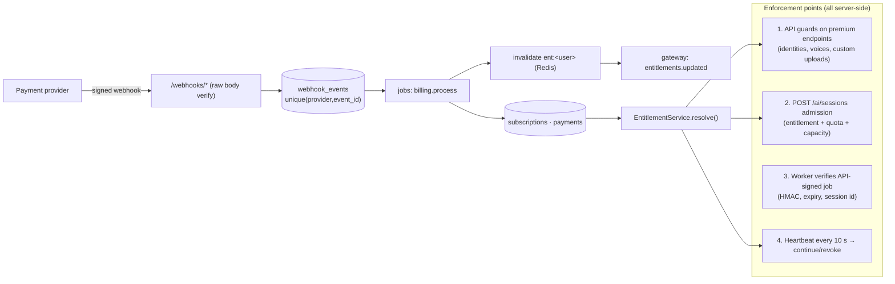

# 05 — Security, Entitlements & Privacy

## 1. Authentication

| Concern | Design |
|---------|--------|
| Identity provider | Supabase Auth: email + password (with breached-password check), Google/Apple OAuth, email verification required before calling or messaging |
| Web sessions | `@supabase/ssr`: tokens in **httpOnly, Secure, SameSite=Lax cookies** on the web origin. Server components read the cookie. Client code sends the access token to the API as a Bearer header (short-lived, about 1 h) |
| API verification | Asymmetric JWT verified against cached JWKS (`kid` rotation supported), plus `exp/iss/aud` checks. No shared secret in the API |
| MFA | Optional TOTP for users. **Mandatory for all staff**: admin endpoints require `aal2` in the token |
| Account recovery | Supabase reset flow. Changing email or password revokes other sessions and sends a notice to the old email |
| Bot/abuse | Rate limits on sign-up, CAPTCHA only after risk signals (we don't show it to everyone), disposable-email blocklist |
| Age | DOB collected at sign-up. **Under-18s cannot use calls, discovery or AI features.** Final age policy per legal review |

## 2. Authorization model

Three independent layers, all evaluated on the server:

1. **Account state**: `users.status` (active / suspended / banned) + active moderation actions.
2. **Relationship and privacy rules** (per resource): blocks (both directions), `who_can_call` / `who_can_message` / `profile_visibility` / `online_visibility`, and conversation and call membership.
3. **Role (staff)** and **entitlement (product)**, which are kept separate:
   - Staff RBAC: `moderator ⊂ admin ⊂ super_admin`, plus `support` (read-mostly). Declared per endpoint with `@Roles()`.
   - Product entitlements: `@RequiresEntitlement('ai.identity')`, resolved as in 03 §3.

Implementation: NestJS guards (`AuthGuard` → `AccountStateGuard` → `RolesGuard` / `EntitlementGuard`) plus **policy functions inside services** for resource checks (`canCall(caller, callee)`, `canViewProfile`, `canMessage`). Every rule is covered by unit tests. Block checks live in one `RelationshipPolicy` so no endpoint can forget them.

Denials return `404` rather than `403` wherever a `403` would reveal that a blocked or private resource exists.

## 3. Premium entitlement architecture

- **The backend alone decides Premium (D6).** The source of truth is `subscriptions.status` in our DB, surfaced as `user_premium_status.has_premium_access` (true only for `PREMIUM_ACTIVE` within the paid period). We never trust frontend `isPremium` flags, localStorage, browser state, UI visibility or any subscription value the user sends.
- **Every AI identity/voice operation is checked**, not just the entry point:

  | Operation | Check |
  |-----------|-------|
  | Get upload URL · create identity/voice · rename · set default | `PREMIUM_ACTIVE` (API guard) |
  | Processing job starts (validation, preparation) | Re-checked in the job. If Premium lapsed since upload, processing stops and the upload is purged |
  | AI control accepts a preparation request | Only API-signed requests carrying `{userId, identityId, premiumCheckedAt ≤ 60 s ago}`. AI services have **no public ingress** |
  | List identities/voices | Allowed, with a `locked: true` flag when not Premium |
  | Select / preview / apply / switch in a call | `PREMIUM_ACTIVE` at `POST/PATCH /ai/sessions` |
  | While transforming | Heartbeat every 10 s → `revoke` as soon as the status is no longer `PREMIUM_ACTIVE` |
  | Delete / export own identities and voices | **Always allowed** (data-protection rights) |

- **The worker cannot be started without the API.** Dispatch goes API → LiveKit agent dispatch with signed metadata. Workers reject unsigned or expired jobs and publish only into the room named in the signature.
- **Payment states → entitlement:** see 08 §4. Only `PREMIUM_ACTIVE` unlocks AI. `PREMIUM_PAST_DUE` is blocked **immediately**, with no grace period. Refund or chargeback → `PREMIUM_CANCELLED` + an `ai_access_revoked` review flag.
- **Reconciliation job** (daily per provider) plus an **expiry sweeper** (every 5 min): compare provider subscriptions with local rows and alert on drift. Webhooks can be missed.

## 4. Threat model (STRIDE summary)

| Threat | Example | Controls |
|--------|---------|----------|
| Spoofing | Forged JWT; client claims premium; fake AI worker | JWKS verification. Server-side entitlements. `ai-worker:` identity prefix minted only by the API; worker ↔ API over mTLS + HMAC |
| Tampering | Modified upload (polyglot file); webhook forgery; replay | Magic-byte check + re-encode + malware scan. Provider signature verification on the raw body. Idempotency keys, `webhook_events` uniqueness |
| Repudiation | Staff abuse; "I never consented" | Append-only `admin_logs`. Immutable `consent_records` with document version, time, IP hash and UA |
| Information disclosure | Raw camera leaking to the peer; enumerating private profiles; embedding theft | Separate ingest room with `canSubscribe:false` for the user and only the worker allowed to subscribe. 404-on-deny. Private buckets with **per-object envelope encryption** (KMS) for identity/voice data, short signed URLs, staff access logged |
| Denial of service | Call-spamming a user; GPU exhaustion; upload floods | Per-user and per-IP rate limits. Ring limits. GPU admission control + per-user concurrent AI session limit = 1. WAF. Upload quotas |
| Elevation of privilege | IDOR on `/identities/:id`; user minting a worker token | Ownership check in the service layer on every by-id route (tested). Token minting code has no path that takes an identity string from the client |

**Baseline controls:** HTTPS everywhere with HSTS. Strict CSP on web and a stricter one on admin. CORS allowlist. `helmet`. Secure/httpOnly cookies. CSRF protection for cookie-authenticated routes (the API itself uses Bearer tokens). Secrets in a secret manager, never in the repo. Dependency and container scanning in CI (Dependabot, Trivy). SAST (CodeQL). Least-privilege DB roles (03 §6). Private networking between services. Backups with point-in-time recovery, restore-tested each quarter.

**Uploads:** client → signed PUT to a **quarantine** bucket, with content-type and max size in the signature → server-side validation (MIME sniffing, dimensions, decompression-bomb guard, re-encode to a canonical format, strip metadata) → malware scan (ClamAV or a managed scanner) → only then moved to the destination bucket. Images are never served from quarantine.

## 5. Privacy by design

| Principle | Implementation |
|-----------|----------------|
| Minimal collection | Only what each feature needs. No raw call media stored. AI sessions keep metadata only |
| Explicit, specific consent | Separate consents for **biometric processing** (the user's own face geometry, which is tracked to drive the identity), **each identity upload** (rights attestation) and **each custom voice**. Each is versioned and can be withdrawn |
| User control | Delete any identity/voice instantly (Premium not required). Account export. Account deletion. "Delete all my AI data" button in Settings → AI |
| Minimal retention | See 03 §5. The encrypted identity source is kept only so identities can be re-prepared when models change (D3), and it is deleted with the identity. Locked identities and voices are purged 30 days after Premium ends, with a warning email at day 20 (D9) |
| Separation | Biometric-like data in separate buckets and KMS keys, **per data region** (01 §7). The AI service never sees user profile data beyond ids |
| Processor transparency | Privacy policy lists processors (LiveKit, Paystack, Stripe, cloud GPU host, email) and cross-border transfers |
| Per-market legal review | See §9. **Required for every market actually launched** (D2) |

## 6. AI disclosure (enforced, not optional)

1. **Sender side**: a persistent "AI Identity active" / "Voice transformation active" pill in the call top bar. It cannot be hidden while active.
2. **Receiver side**: any participant whose identity starts with `ai-worker:` renders with an **"AI" badge on the tile** and in the participant list ("Ava is using an AI identity"). The badge comes from LiveKit participant attributes that **only the API can set** (tokens are server-minted), so a sender cannot hide it.
3. **In the pixels**: the worker burns a small visible "AI" corner mark into every frame and embeds an invisible watermark (session id), so screenshots and recordings stay traceable.
4. **Audio**: when a voice is transformed, the peer's UI shows it. A short audible chime can be added on activation if legal review asks for it.
5. **Livestreams and replays**: the "AI-transformed" label appears on the stream card, the player and the replay.
6. **Records**: `ai_processing_sessions` links every transformed minute to a user, an identity/voice and a consent record, for abuse investigations.

## 7. Identity policy and abuse prevention

**Policy (D4):** Premium users may upload **any image of their choice** as an identity; it does not have to be their own face. The platform's job is to (a) make sure nobody is misled into thinking the transformed person *is* the person in the image, and (b) stop clearly unlawful or abusive use.

### 7.1 Upload rules (validation pipeline, 01 §2.3)

| Check | Result on failure |
|-------|-------------------|
| Premium active (`PREMIUM_ACTIVE`) | `premium_required` → upgrade prompt (D7) |
| Format: JPEG / PNG / WebP only (magic bytes, not just the extension), re-encoded server-side, metadata stripped | `upload_invalid_type` |
| Size ≤ 10 MB, dimensions 256–4096 px, decompression-bomb guard | `upload_too_large` / `upload_invalid` |
| Malware scan | `upload_rejected` (no detail given to the user) |
| Exactly one clearly visible face, minimum face size, blur/lighting/pose scores | `no_face` · `multiple_faces` · `face_too_small` · `too_blurry` with a "good photo" example |
| **Apparent minor** (age-estimation screen) | **Hard reject** + review. Never usable |
| **Sexual / nudity content** classifier | **Hard reject** |
| Hash match against images removed after reports (perceptual hash) | Hard reject |
| Rights attestation ticked (see 7.2) | `consent_required` |
| Rate limits: new identities per day, total identities per plan (`identities.max`) | `rate_limited` / `limit_reached` |

**Public figures** are *not* blocked by default, because D4 allows images of your choice. Uploads that match a well-known public figure (if we add a similarity screen) are **flagged** for moderation sampling and get stricter abuse-report handling. Whether to block them is a per-market decision after legal review (§9), controlled by `country_feature_flags`.

### 7.2 Rights and terms language (shown before the first upload; stored in `consent_records`)

> By uploading, you confirm that you have the right to use this image for AI transformation, that you will not use it to deceive, defraud, harass, or impersonate anyone, and that the people you talk to will see that your video is AI-transformed. Misuse can lead to removal of the identity, loss of Premium features, and account suspension.

The user picks a basis (`self`, `licensed`, `subject_permission`, `original_artwork`, `public_domain`, or a general `rights_attestation`). The exact wording will be finalised by counsel for each market.

### 7.3 Anti-deception controls (always on)

- Enforced disclosure (§6): sender pill, receiver badge the sender cannot remove, burned-in "AI" mark, invisible watermark.
- **Never labelled as a real person:** the peer sees the *caller's* MorphCall name and profile ("Ava Lopez · AI identity"), never a name taken from the image. Identity names are private to the owner.
- Report reasons `impersonation`, `deepfake_misuse`, `scam` and `minor_safety` go to the priority queue with the AI session and identity attached (metadata only). Moderators can view the identity thumbnail (access-logged) and disable it, and every other identity with the same perceptual hash.
- Public "report misuse of my likeness or voice" form (no account needed), with a takedown SLA.
- Confirmed abuse → `identity_disabled` / `ai_access_revoked` / suspension via `moderation_actions`.

### 7.4 Voices

- Custom voices require a **rights attestation** (same pattern as identities).
- **Recommended default:** when a user adds another person's voice, the speaker **reads a randomly generated consent phrase** in the recording, which ASR checks. This is the strongest practical guard against voice-cloning fraud. It can be tuned per market with `country_feature_flags` after legal review.
- Preset voices are synthetic or properly licensed.

### 7.5 Account-level abuse signals

Device/IP risk signals, velocity limits on identity creation and deletion, payment method as an identity signal, and an optional phone check before first AI use in higher-risk markets.

## 8. Security testing plan

- Unit tests for every policy function and guard. Authorization matrix tests (every route × every role or ownership case).
- Integration tests: webhook signature failures, replayed events, entitlement lapse mid-call, IDOR attempts.
- Pre-launch external penetration test. Continuous dependency scanning.
- Chaos tests for AI fallbacks (kill a worker mid-call → the user must be paused, never shown raw).
- Premium enforcement tests: every AI endpoint and job for each of `FREE`, `PENDING`, `PREMIUM_PAST_DUE`, `PREMIUM_CANCELLED`, `PREMIUM_EXPIRED` → denied. Forged client flags are ignored. Revocation mid-call happens in ≤10 s.

## 9. Per-market compliance (D2)

Nigeria is the operating base, but **Nigerian compliance is not assumed to cover anyone else.** Before AI features (or the service as a whole) launch in a market, the team completes this checklist with local counsel and records the result in `country_feature_flags`:

| Area | Examples of what to check |
|------|---------------------------|
| Data protection | Nigeria NDPA 2023 / NDPC regulations. EU/EEA GDPR (Art. 9 special-category data → DPIA, legal basis, EU representative). UK GDPR. Kenya DPA, South Africa POPIA, Ghana DPA. US state privacy laws (e.g. CCPA/CPRA) |
| Biometric laws | Illinois BIPA (written consent, retention schedule, private right of action), Texas CUBI, Washington biometric law, and others as they appear. Face-geometry tracking of the *user* may count as biometric processing even though we don't identify anyone |
| AI transparency / deepfakes | EU AI Act transparency duties for synthetic content, national deepfake and impersonation laws, election-period rules |
| Cross-border transfers | Transfer mechanisms (SCCs etc.) for data leaving the user's region → drives `data_region` (01 §7) |
| Consumer / subscription law | Auto-renewal disclosure and cancellation rules, VAT/digital-services tax. **Specifically confirm that "cancel = immediate end, no refund" (D8) is enforceable** in each market. Some jurisdictions give statutory withdrawal or refund rights for digital subscriptions (e.g. EU/UK cooling-off rules, which need explicit waiver wording at checkout). Where the law requires a refund, it is issued via the audited admin refund action |
| Payments | Provider availability and business-category eligibility for this product in that market (08 §3) |
| Age & online safety | Minimum age, age assurance duties, online-safety regimes (e.g. UK Online Safety Act) |
| Lawful access / retention | Record-keeping duties, law-enforcement request handling |

Features can be switched off per country (`country_feature_flags`) without a deploy, so the service can launch in a market before AI features are cleared there.
