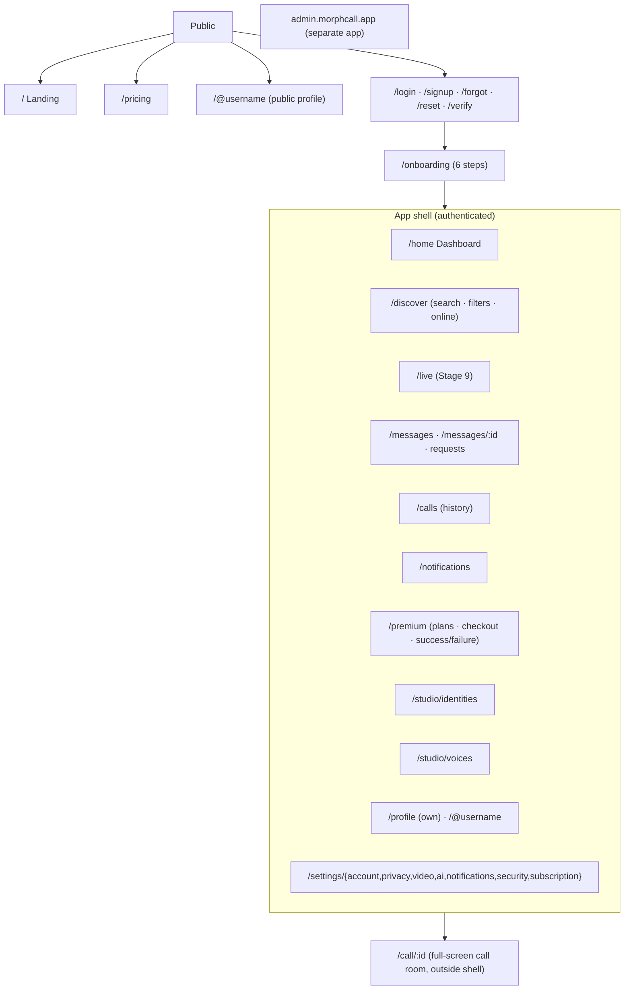

# 06 — Design System & UX Architecture

Source: the MorphCall Uizard mockup (primary), the UI/UX brief, and the Dribbble "Called" shot (polish only). Colour values below were sampled from a screenshot and are **provisional until confirmed against Uizard Handoff/Export**.

## 1. Design principles

1. **The video is the product.** Inside a call, chrome recedes: controls float, fade when idle and never cover the remote face region.
2. **AI state is always legible.** At any moment the user can tell what is transformed, whether it is processing, whether Premium is required and how to turn it off (brief §33).
3. **One click to transform.** Button → panel → select → preview → apply. There are no page navigations inside a call.
4. **Calm premium, not sci-fi.** Dark navy surfaces, one confident accent, glow reserved for "live/active" meaning only.
5. **Colour has meaning.** Indigo = action, cyan = AI-transformed, violet = Premium, green = online/success, red = end/record/error. Every colour signal has a text or icon twin (accessibility).

## 2. Tokens

Implemented as CSS custom properties consumed by Tailwind (`theme.extend.colors = { bg: 'rgb(var(--bg) / <alpha-value>)', … }`) and shadcn/ui's variable names. Tokens live in `packages/ui/tokens.css`.

### 2.1 Colour (semantic)

| Token | Dark (default) | Light | Use |
|-------|----------------|-------|-----|
| `--bg` | `#070B14` | `#F6F7FB` | App background |
| `--surface` | `#0B1220` | `#FFFFFF` | Nav, panels |
| `--card` | `#0F172A` | `#FFFFFF` | Cards |
| `--card-elevated` | `#141D33` | `#F1F3F9` | Popovers, sheets, hovered cards |
| `--border` | `#1E293B` | `#E3E7EF` | Hairlines |
| `--border-strong` | `#2B3752` | `#CBD2DF` | Inputs, focused containers |
| `--text` | `#E7EBF3` | `#0B1220` | Primary text |
| `--text-muted` | `#8A94A8` | `#5A6477` | Secondary text |
| `--text-subtle` | `#5D6780` | `#8A93A6` | Captions, timestamps |
| `--primary` | `#5B5BF6` | `#4F46E5` | Primary buttons, links, focus ring |
| `--primary-hover` | `#6D6DF8` | `#4338CA` | |
| `--on-primary` | `#FFFFFF` | `#FFFFFF` | |
| `--ai` | `#22D3EE` | `#0891B2` | **Reserved** for AI-transformed state: badges, active AI buttons, disclosure pills |
| `--premium` | `#A78BFA` | `#7C3AED` | Premium badges, upgrade surfaces |
| `--success` | `#22C55E` | `#16A34A` | Online, success, "Live" dot (with label) |
| `--warning` | `#F59E0B` | `#B45309` | Degraded, past due |
| `--danger` | `#EF4444` | `#DC2626` | End call, record, destructive, errors |
| `--video-scrim` | `rgba(3,6,12,.55)` | same | Control backdrops over video (always dark, even in light mode) |

**The call screen is always dark**, regardless of theme. Video looks best there and the brief asks for it. Light mode applies to the rest of the app.

Contrast: all text/background pairs above target **WCAG AA** (4.5:1 body, 3:1 large text and UI). This gets verified with a script in Stage 1, and a token is adjusted wherever a pair fails.

### 2.2 Typography

- **Font:** Inter (variable), with `font-feature-settings: "tnum"` for timers, counts and prices. *Swap in the Uizard handoff font if it differs.*
- Scale (px / line-height / weight): Display 40/48/700 · H1 32/40/700 · H2 24/32/600 · H3 18/26/600 · Body 15/22/400 · Body-sm 13/20/400 · Label 13/16/500 · Caption 12/16/400 · Overline 11/16/600 (uppercase, +4% tracking).
- Navigation labels use Label. Card titles use H3. The dashboard hero uses Display.

### 2.3 Space, radius, elevation, motion

- Spacing on a 4 px base: 4, 8, 12, 16, 20, 24, 32, 40, 48, 64.
- Radius: `sm 8` (inputs, chips) · `md 12` (buttons) · `lg 16` (cards) · `xl 20` (video tiles, sheets) · `full` (avatars, call-control pill).
- Elevation: flat cards with a 1 px border in dark mode. Shadows only for floating layers (`0 8px 32px rgba(0,0,0,.45)`). Glass (backdrop-blur 16 px + scrim) **only over video**.
- Motion: 120 ms (hover/press), 200 ms (panels, `cubic-bezier(.2,.8,.2,1)`), 300 ms (identity crossfade). Respect `prefers-reduced-motion` (no scale/slide, opacity only).
- Breakpoints: `sm 640 · md 768 · lg 1024 · xl 1280 · 2xl 1536`. Desktop layout ≥1280.

## 3. Component library (`packages/ui`)

Built on shadcn/ui (Radix primitives, so focus management and ARIA come built in), restyled with the tokens.

| Group | Components |
|-------|-----------|
| Primitives | Button (primary, secondary, ghost, destructive, premium, ai; sizes sm/md/lg/icon), IconButton, Input, Textarea, Select, Combobox, Checkbox, Switch, RadioGroup, Slider, Tabs, Tooltip, Popover, DropdownMenu, Dialog, Sheet, Drawer (mobile), Toast, Alert, Badge, Chip, Skeleton, Spinner, Progress, EmptyState, ErrorState, ConfirmDialog |
| Identity & social | Avatar (+ status dot + AI ring), AvatarStack, ProfileCard (dashboard/discover variants), ProfileHeader, FollowButton, PresenceBadge, InterestChip, UserListItem |
| Messaging | ConversationListItem, MessageBubble (text/image/file/voice-note/call-event), TypingIndicator, ReadReceipt, Composer |
| Call | VideoTile (remote/local/screen, speaking ring, muted/AI/quality badges), LocalPreview (draggable), CallTopBar, ControlPill, ControlButton (toggle with states), ConnectionQualityChip, CallTimer, ReconnectingOverlay, PermissionGate, CallSummarySheet, IncomingCallToast |
| AI | AIStatusPill, AIIdentityPanel, IdentityCard, IdentityUploader (with consent step), BeforeAfterPreview, VoicePanel, VoiceCard (play/preview/select/active), ConsentAttestation, AIDisclosureBadge |
| Premium | PlanCard, BillingToggle (monthly/annual + savings), FeatureComparisonTable, PremiumBadge, UpgradeGate (inline lock + CTA), SubscriptionStatusBanner, BillingHistoryTable |
| Layout | AppShell (top bar + left nav + content + right rail), NavRail/NavItem, MobileTabBar, PageHeader, SectionCard |
| Admin | DataTable (sorting, filters, pagination), StatCard, TimeSeriesChart, AuditLogItem, ModerationActionDialog |

Every component ships with **all states** where they apply: default, hover, focus-visible, active/pressed, selected, disabled, loading, success, error, empty. Stories live in Storybook with a light/dark toggle and axe accessibility checks in CI.

## 4. Information architecture



- **Left nav** (from the mockup): Home, Discover, Live, Messages, Calls, Notifications, Premium, Profile, Settings. "AI Studio" (Identities + Voices) is reached from Premium and Settings → AI, and as a secondary nav item for Premium users.
- **Dashboard layout** (mockup): left column = nav + Online Now + Scheduled Calls. Centre = hero/feature strip (collapses to a slim "welcome back" card after first use), Recommended People, Continue/recent calls. Right rail = Notifications, Premium card (hidden for Premium users → AI minutes left), Recent Messages.
- **Mobile:** bottom tab bar (Home, Discover, Messages, Calls, Profile), right-rail content becomes cards in the feed, AI panels become bottom sheets. This is designed on purpose, not the desktop layout shrunk.

## 5. Video-call interaction model

```
┌──────────────────────────────────────────────────────────────────────┐
│ ● Ravi Menon  · Connected · 00:12:34   [AI Identity: ON ◉]  HD·Stable ⋯ │ ← top bar (auto-hide)
│                                                                      │
│                    REMOTE VIDEO (fills stage, object-fit: cover)     │
│                    remote AI badge ▸ top-left of tile if peer is AI  │
│                                                    ┌──────────┐      │
│                                                    │ You (AI) │ ←local preview, draggable,
│                                                    └──────────┘      snaps to 4 corners
│        ( 🎤  📷  🔊 │ ✦ Identity  ♪ Voice  ✧ Effects │ ⎘  💬  ⋯ │ ⏻ )   │ ← ControlPill
└──────────────────────────────────────────────────────────────────────┘
                     side panels (Identity/Voice/Chat) slide in from the right, 360 px,
                     and the video stage *resizes* (it is not covered)
```

**Visibility:** controls are fully visible on join, on pointer movement, on keyboard focus and while a panel is open. After 3 s idle they fade to 0 (top bar and pill), leaving the persistent AI pill and the timer at 60% opacity. Touch: tap toggles. Controls never fade while a menu is open or focus is inside them.

**Keyboard:** `M` mic · `V` camera · `I` identity panel · `O` voice panel · `E` effects · `C` chat · `S` share screen · `Esc` close panel · `Ctrl/⌘+Shift+H` hang up (with confirm). Shortcuts are listed in "⋯ → Keyboard shortcuts".

**ControlButton states:** default · hover · focus-visible (2 px `--primary` ring + 2 px offset) · active (on) · off (e.g. mic muted = red slash icon + "Unmute" label) · disabled (with tooltip reason) · loading (spinner in place of icon) · error (amber dot + tooltip) · premium-locked (small violet lock; click opens the upgrade sheet, never a dead end).

**AI Identity flow (in call):**
`AI Identity: OFF` → click → **panel**: *Natural (off)* · *My identities* (cards with thumbnail, name, default star) · *+ Add identity* (opens the uploader in a nested sheet, and the call continues) → select → **Preview** (self-view shows Original ↔ AI side-by-side for the user only; nothing changes for the peer) → **Apply** → button shows `Starting…` → `AI Identity: ON` (cyan) + toast "Your video is AI-transformed. Ravi can see an AI badge." → **Turn off** is the first item in the panel and in the pill's menu.

Identity states: `OFF · LOADING (fetching) · PROCESSING (worker starting, progress shimmer) · ACTIVE · DEGRADED (amber) · FAILED (paused dialog, 02 §3.6) · UNAVAILABLE (capacity/region, with retry countdown) · LOCKED (not Premium)`.

**Free users (D7):** the AI Identity and Voice buttons stay **visible**, with a small violet lock. Clicking one, or any `premium_required` error from the API, opens the `UpgradeGate` sheet. The sheet shows a short looping demo and this copy:

> **AI Identity is a Premium Feature**
> Transform your appearance in real time during video calls using your saved AI identities.
> **[Upgrade to Premium]**   Not now

The voice version reads *"AI Voice is a Premium Feature — Change how you sound in real time during calls using your voice library."* Past-due users see *"Your payment didn't go through. Update your payment method to restore AI features."* with **[Update payment method]** (from `premium_past_due`). Lapsed users can still open AI Studio to **view, export or delete** their locked identities and voices, with a "Renew to use" banner.

**Voice flow (Premium, D5):** the same structure. Each VoiceCard has name, descriptor ("Warm, rich low-end"), ▶ preview (plays a pre-rendered clip, available to everyone; "Hear yourself" plays your last 5 s converted, Premium only), select radio, Active tag. "Natural voice" is pinned first and restores the voice in one click.

**Peer-side view:** the remote tile gets a cyan "AI" badge (and "AI voice" when voice is on). Hovering it shows "Ravi is using an AI identity". The badge cannot be turned off.

**Pre-join screen:** camera/mic preview, device pickers, "Join with AI Identity" toggle for Premium users (the AI session starts before joining so the peer never sees the raw feed), and permission help.

## 6. State catalogue (required error/empty/loading states)

| Situation | Screen treatment | Primary action |
|-----------|------------------|----------------|
| Camera permission denied | PermissionGate with browser-specific instructions + illustration | "Try again" · "Join with audio only" |
| Microphone denied | Same | "Try again" · "Join muted" |
| Poor network | Quality chip turns amber/red + "Your connection is unstable" toast. Video drops to a lower layer automatically | "Turn off my video" |
| Call disconnected | ReconnectingOverlay (spinner + countdown 20 s) → Call ended sheet with reason | "Call again" |
| AI processing unavailable / GPU overload | Inline in panel: "AI Identity is busy right now." Retry with countdown. The call continues untouched | "Retry" |
| AI failed mid-call | Paused dialog (02 §3.6). Never raw fallback | "Retry AI" · "Use real camera" · "Stay hidden" |
| Invalid identity image | Uploader error with the specific reason (no face / several faces / too small / too blurry / unsupported file / against policy) + example of a good photo | "Choose another photo" |
| Voice processing unavailable | Voice panel inline error, natural voice kept | "Retry" |
| Cancelling Premium | Destructive ConfirmDialog: Premium ends **immediately**, **no refund**, AI data locked and deleted after 30 days (exact copy in 08 §4). "Keep Premium" is the default-focused button | "Cancel now" (danger) |
| Subscription expired / cancelled | Locked AI buttons + banner "Premium ended on 12 Sep". AI Studio shows "Your identities and voices will be deleted on <ended + 30 days>" | "Subscribe again" |
| Payment failed (`PREMIUM_PAST_DUE`) | Checkout failure page + persistent banner in app. **AI features locked immediately** (D6) | "Update payment method" |
| Choosing how to pay | Checkout sheet lists the available providers for the user's currency (e.g. "Pay with Paystack · ₦" / "Pay with card via Stripe · $"), with the suggested one preselected | "Continue to payment" |
| User unavailable / busy / blocked | Call screen resolves in ≤2 s to a friendly card ("Maya isn't available right now") | "Send a message" |
| Room unavailable | "This call has ended or doesn't exist" | "Back to Calls" |
| Server error | ErrorState with request id | "Retry" |
| Empty lists | EmptyState with illustration + next step (e.g. no calls → "Find people to call") | Contextual |
| Loading | Skeletons shaped like the final content. **No blank spinners longer than 300 ms** | — |

## 7. Accessibility checklist

WCAG 2.2 AA. Full keyboard navigation with visible focus. Radix focus-trapping in dialogs and sheets. `aria-live="polite"` announcements for call state, AI state changes, incoming messages and reconnecting. `aria-live="assertive"` for incoming calls. Icons always have labels. Status never uses colour alone (icon + text). Captions/subtitles are on the roadmap for calls. Minimum hit target 40 px (44 on touch). Tested with axe in CI + manual NVDA/VoiceOver passes on the call screen.

## 8. Design deliverables mapping

The design brief's deliverables (flows, IA, wireframes, hi-fi, component library, dark/light, prototypes, handoff) are produced as code-first artefacts: Storybook (component library and states), a `/design` route in staging (token and typography specimen), Playwright screenshot snapshots per state, and Figma/Uizard frames only where the design team needs them. This keeps design and implementation from drifting apart.
