# 07 — MVP Scope & Implementation Roadmap

## 1. MVP definition

**MVP = Stages 1–6**: a stranger can sign up, find someone, have a good 1-to-1 video call safely, pay for Premium, and use an AI identity and an AI voice in that call, with enforced disclosure.

| In MVP | Deliberately out of MVP |
|--------|-------------------------|
| Email/OAuth auth, onboarding, profiles, discover/search, follow | Friends and favorites UI (tables exist) |
| 1-to-1 calls, call history, call summary | Group calls |
| **Block + report + basic admin moderation queue (moved up to Stage 2)** | Full admin analytics |
| Premium monthly/annual via **Paystack and Stripe**, checkout, self-service management, billing history | Creator subscriptions, paid streams, more providers |
| AI Identity (upload any image → library → in-call), using whichever track passes Stage 4 (portrait reenactment or stylized). AI Voice (DSP voices, then neural voices) | Photoreal face swap (Track B), custom voice cloning (can follow right after) |
| Minimal messaging (1-to-1 text, needed for "Maya isn't available → message her") | Group chat, attachments, voice notes, search |
| In-app notifications for calls/messages/follows | Web push, email digests |
| Dark + light, desktop-first, responsive for tablet/mobile browser | Native apps |

**Why block/report moves to Stage 2:** the product connects strangers by video. Shipping calls without safety tools is not acceptable, even in a beta.

## 2. Stages and exit criteria

Each stage ends with a working, deployed, demo-able vertical slice on staging. We don't start the next stage until the exit criteria are met.

### Stage 0 — Foundations (in progress: this document set)
- Architecture, ERD, API, security, design system, roadmap. ✅ drafted
- **Exit:** these docs reviewed and open decisions (§5) answered.

### Stage 1 — Auth, profiles, basic UI
- Monorepo scaffold (pnpm/Turborepo), CI pipeline, environments, Sentry, OpenTelemetry.
- `packages/ui` tokens + core primitives + Storybook. App shell matching the Uizard dashboard.
- Supabase Auth (email, Google), verification, reset. NestJS auth guard (JWKS). Migrations in `supabase/migrations`.
- Onboarding (7 steps), profile view/edit, avatar upload pipeline, discover + search, follow, landing page.
- **Exit:** a new user signs up → onboards → edits their profile → finds and follows another user, in dark and light, on desktop and mobile widths. Authz matrix tests green. Lighthouse ≥90 on landing.

**Status (2026-09-19): built, awaiting sign-off.**

| Item | State |
|------|-------|
| Monorepo, CI (format, typecheck, tests with Postgres service, build) | ✅ |
| Migrations 0001–0003 applied to `morphcall-dev` (eu-west-2); security advisor clean | ✅ |
| API: JWKS auth guard, account/age/onboarding gates, per-user rate limits, me/profile/settings/avatar, discover, search, follow + requests, block-aware visibility | ✅ 33 tests (19 end-to-end against real Postgres as the least-privilege role) |
| Web: landing, sign-up/login/verify/forgot/reset, Google button, 7-step onboarding, app shell, home, discover, profile, settings, notifications (follow requests), premium page (checkout arrives in Stage 3), placeholder pages for later stages | ✅ production build passes. Public pages checked in the browser (dark, light, mobile) |
| Design system: tokens + components, `/design` specimen page | ✅ Storybook deferred. `/design` covers review for now |
| Sentry / OpenTelemetry | ⏳ wired when a DSN/collector exists (Stage 2) |
| Signed-in flow in a real browser | ⏳ needs the product owner to sign up (Claude cannot create accounts); Supabase Auth URL config + SMTP (see root README) |
| Lighthouse ≥90 | ⏳ to measure on a deployed preview |

### Stage 2 — 1-to-1 video calling (LiveKit) + safety basics
- Rooms, token minting, call state machine, ringing via gateway, ring timeout jobs, LiveKit webhooks → durations.
- Call screen v1 (the interaction model in 06 §5 with non-AI controls), pre-join, permission gates, reconnect overlay, call summary, call history.
- Presence (Redis). Block and report. Admin app skeleton with the report queue + suspend/ban (MFA-gated).
- Client-side free effects: background blur.
- **Exit:** two browsers on different networks complete a 30-minute call. p95 join time < 3 s. Glass-to-glass < 250 ms same-region (measured). Blocking mid-call ends the call. All error states in 06 §6 for calls are reachable and correct.

### Stage 3 — Premium subscriptions + payments (Paystack + Stripe)
- Verify with both providers: merchant eligibility for this product category, recurring billing, currencies (NGN, USD), payouts (D1).
- `PaymentProvider` interface + **Paystack and Stripe adapters**, `plan_prices` seeded per provider × currency, provider choice at checkout, webhooks → internal state machine (08 §4) → `subscription_events`, expiry sweeper, daily reconciliation, entitlement cache + `entitlements.updated`.
- Premium page, feature comparison, checkout sheet with provider choice, billing history, past-due banner, upgrade gates in the call UI (locked AI buttons with the D7 prompt).
- **Exit:** for **each provider** in test mode: purchase, renewal, failed payment (→ `PREMIUM_PAST_DUE`, AI locked immediately), cancel from our app *and* from the provider's own portal/link (→ `PREMIUM_CANCELLED` immediately, no refund, live AI session revoked ≤10 s), plan switch, refund and dispute all land in the correct internal state within 10 s of the webhook. A second subscription on the other provider is refused. Replayed and forged webhooks are rejected. Forged client `isPremium` flags have no effect (tested).

### Stage 4 — AI real-time proof of concept (R&D track, starts in parallel with Stage 2)
The first objective (D3) is **a working real-time proof of concept on open-source, commercially usable tech**:
- **4a — Walking skeleton (early):** Python worker on LiveKit that receives the ingest room's video and publishes a *trivially* transformed stream (e.g. a MediaPipe-landmark overlay or stylized filter) with the disclosure mark. This proves the whole media path, latency measurement, A/V sync and the privacy-safe fallback before any heavy model is involved.
- **4b — Candidate benchmarks:** harness with recorded clips (varied skin tones, lighting, glasses, beards, head turns ±45°, occlusion) → Track A (portrait reenactment), Track C (stylized avatar) and voice candidates (02 §5), exported to ONNX/TensorRT on the target GPU class. Every candidate gets a license review of code, weights and data.
- **4c — Production identity pipeline:** Premium-gated upload → validation (05 §7.1) → rights attestation → prepared asset + encrypted source → Identity Library UI.
- **Exit (decision gate):** (1) an identity applied to a live LiveKit call, driven by the user's head, face, mouth and expressions, **meeting the §4 latency budget**; (2) a written scorecard against the 02 §5.1 criteria with measured cost per AI-minute; (3) the launch choice: **Track A** if it passes the quality bar, otherwise **Track C stylized** (approved as an acceptable first release, D3).

### Stage 5 — Real-time AI identity inside calls
- Python worker on LiveKit Agents: ingest room, GPU pipeline, A/V synchronizer, disclosure mark + watermark, heartbeats/usage, revoke.
- API: `/ai/sessions` admission (entitlement, quota, capacity), signed dispatch, quota metering.
- UI: AI Identity panel, preview, apply/switch/off, peer badge, all AI states, privacy-safe failure dialog, AI Studio → Identities.
- **Exit:** 30-minute call with identity on at ≥24 fps, added latency ≤100 ms p95. A killed worker results in the user being paused (never raw) within 2 s. The disclosure badge cannot be removed by a modified client (verified by test). Quota and lapse revocation work.

### Stage 6 — Voice transformation (Premium only)
- **6a:** DSP voices in the worker (server-authorised), Voice panel + Studio → Voices, switching, and "Natural voice".
- **6b:** Neural voices behind the `VoiceConverter` interface (02 §6), once a candidate passes the gates. Custom voices with rights attestation + consent phrase.
- **Exit:** DSP adds ≤30 ms and neural adds ≤120 ms p95 audio latency. The ASR word-error-rate increase stays within the gate. No lip-sync drift > 80 ms with identity + voice. Switching and "Natural voice" are instant and glitch-free. Free users cannot activate any voice (tested server-side).

### Stage 7 — Messaging + notifications (full)
Group chats, attachments (scanned), voice notes, message requests, search, read receipts. Notification centre for all types, web push, email for important events.

### Stage 8 — Social
Friends, favorites, recently contacted, follow requests for private profiles, better recommendations (interest + graph signals), profile sections (clips/posts placeholders).

### Stage 9 — Livestreaming
Go-live flow, live room, viewer UI, live chat with moderation, viewer count, subscriber-only and paid streams (payments reuse), recording/replay via LiveKit Egress, stream analytics, AI identity for hosts with viewer disclosure.

### Stage 10 — Advanced AI & creator features
Avatar/reenactment mode, group calls with AI, creator subscriptions and payouts, AI effects marketplace, captions/translation.

## 3. Build order (critical path)

```mermaid
gantt
  dateFormat  X
  axisFormat  %s
  section Platform
  S1 Auth/profiles/UI            :s1, 0, 4
  S2 Calls + safety              :s2, after s1, 4
  S3 Premium + payments          :s3, after s2, 3
  section AI track (parallel)
  S4 Benchmarks + license gate   :s4, 3, 6
  S4 Upload/validation pipeline  :s4b, after s2, 2
  S5 Real-time identity          :s5, after s3, 5
  S6 Voice                       :s6, after s5, 3
  section Growth
  S7 Messaging/notifications     :s7, after s6, 3
  S8 Social                      :s8, after s7, 2
  S9 Livestreaming               :s9, after s8, 5
```

Units are relative effort blocks, not calendar weeks. Real dates depend on team size, which we'll set once the team is known. The main point: **the AI R&D and licensing track must start by Stage 2**, or it will block Stage 5.

## 4. Top risks

| Risk | Likelihood | Impact | Mitigation / owner decision |
|------|-----------|--------|-----------------------------|
| No license-clean open model reaches photoreal quality in real time | High | Launch is stylized rather than photoreal | Accepted fallback (D3): Track C stylized. Track A reenactment is the main bet. Replaceable-model architecture so photoreal drops in later |
| A "clean-looking" open model has hidden non-commercial terms (bundled detectors, weights, training data) | High | Legal exposure after launch | License review of code, weights and data per component. Replace InsightFace-derived parts. Registry blocks unreviewed models |
| GPU cost per Premium user exceeds price | Medium | Margin | Measured cost per minute → monthly AI-minute allowance. Efficient batching. Scale-to-zero. Consider a higher "Pro" tier |
| Deepfake abuse or impersonation incidents | Medium | Legal, reputational, payment-provider termination | Controls in 05 §7. Moderation staffing before launch. Clear ToS |
| Biometric/privacy law exposure (BIPA, GDPR Art. 9, NDPA) | Medium | Fines, geo-blocking | DPIA + counsel before public launch. Geo-restrict AI features where needed |
| Payment-provider acceptance of the product category (AI face/voice transformation) | Medium | Can't charge on one provider | Two providers from day one (D1). Early eligibility check with both in Stage 3. Clear policy + disclosure design |
| "Any image" identities used for impersonation or scams (D4) | Medium–High | Legal, trust, provider termination | Hard blocks (minors, sexual content, hash list), enforced disclosure, peer always sees the caller's real MorphCall profile, priority reporting, per-market flags |
| Latency on the AI path feels laggy | Medium | UX | Region co-location, TensorRT, benchmark gates in CI |
| Scope creep across 10 stages | High | Delay | Strict stage exit criteria. Everything not listed is out |

## 5. Decisions

**Resolved (2026-09-18/19):** entity & payments, markets, AI budget/route, identity policy, voice, the Premium rule, the free-user UX, cancellation (immediate, no refund) and the 30-day purge of locked AI data. See [00 Decisions log](00-decisions.md) (D1–D9).

**Still open:**
1. **Pricing:** $9.99/month and $99.99/year come from the mockup. The NGN prices for Paystack need setting, and the monthly AI-minute allowance waits on the Stage 4 cost numbers.
2. **Hosting & GPU:** managed platform (faster) vs AWS/GCP from day 1 (more control). A GPU provider/region is needed for Stage 4 benchmarks (latency to Nigerian users matters: the nearest large GPU regions are typically in Europe, with growing options in Africa).
3. **Team:** who builds? The staging assumes a small full-stack team plus one ML/media engineer from Stage 2 onward.
4. **Design confirmation:** export the exact colours and font from Uizard (Handoff → Export) so the tokens in 06 §2 can be finalised.
