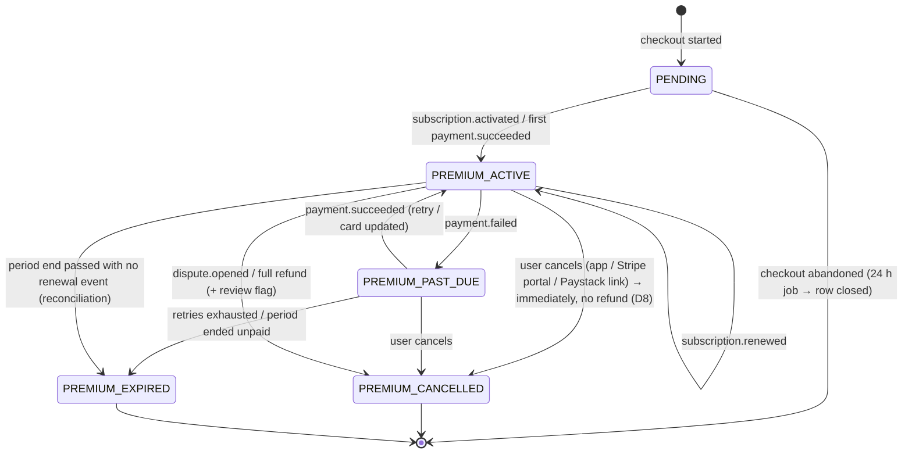

# 08 — Payments & Subscriptions (multi-provider)

Decisions D1, D6 and D7 ([00](00-decisions.md)). **The platform owns subscription and entitlement state.** Providers only move money and report what happened.

```text
User → Checkout (Paystack | Stripe) → Provider → Signed webhook
     → Normalised billing event → Subscription state machine (ours)
     → Internal status (PREMIUM_ACTIVE …) → Entitlements → Premium features
```

## 1. Module layout (`apps/api/src/billing`)

```text
billing/
  billing.controller.ts          # /plans, /subscriptions/*, /billing/*
  webhooks.controller.ts         # /webhooks/:provider (raw body)
  billing.service.ts             # orchestration, provider-agnostic
  subscription-state.ts          # pure state machine (unit-tested exhaustively)
  entitlement.service.ts         # resolve(), cache, invalidation
  reconciliation.job.ts          # daily provider ↔ local diff
  providers/
    payment-provider.ts          # interface below
    provider.registry.ts         # 'paystack' | 'stripe' → implementation
    paystack/paystack.provider.ts
    stripe/stripe.provider.ts
```

Nothing outside `providers/` imports a provider SDK. Adding a third provider (Flutterwave, PayPal, app stores) means one new folder plus seeded `plan_prices` rows.

## 2. Provider interface

```ts
export type ProviderId = 'paystack' | 'stripe';

export interface ProviderCapabilities {
  currencies: string[];                 // e.g. ['NGN','USD'] — from config, verified per account
  immediateCancel: boolean;             // D8: both must support stopping the subscription now, without refund/credit
  proratedPlanChange: boolean;          // Stripe: yes. Paystack: no → scheduled switch
  hostedManagementUrl: boolean;         // Stripe portal / Paystack manage link
  refunds: boolean;
}

export interface PaymentProvider {
  readonly id: ProviderId;
  readonly capabilities: ProviderCapabilities;

  createCheckout(input: {
    userId: string; email: string; price: PlanPrice; successUrl: string; cancelUrl: string;
    idempotencyKey: string;
  }): Promise<{ redirectUrl: string; providerReference: string }>;

  cancelNow(sub: SubscriptionRecord): Promise<void>;   // D8: stop billing immediately, no refund, no credit
  changePlan(sub: SubscriptionRecord, to: PlanPrice): Promise<{ effective: 'now' | 'period_end' }>;
  managementUrl?(sub: SubscriptionRecord): Promise<string>;
  refund?(payment: PaymentRecord, amountMinor?: number): Promise<void>;

  verifyWebhook(rawBody: Buffer, headers: Record<string, string>): boolean;
  parseWebhook(rawBody: Buffer): NormalizedBillingEvent[];
  fetchSubscription(providerSubscriptionId: string): Promise<ProviderSubscriptionSnapshot>; // reconciliation
}

export type NormalizedBillingEvent =
  | { type: 'subscription.activated';  ref: ProviderRefs; periodStart: Date; periodEnd: Date }
  | { type: 'subscription.renewed';    ref: ProviderRefs; periodStart: Date; periodEnd: Date }
  | { type: 'payment.succeeded';       ref: ProviderRefs; payment: NormalizedPayment }
  | { type: 'payment.failed';          ref: ProviderRefs; payment: NormalizedPayment; failureCode?: string }
  | { type: 'subscription.cancel_requested'; ref: ProviderRefs; at: Date }  // user cancelled via provider UI → treated as immediate (D8)
  | { type: 'subscription.canceled';   ref: ProviderRefs; at: Date }
  | { type: 'subscription.expired';    ref: ProviderRefs; at: Date }
  | { type: 'refund.succeeded';        ref: ProviderRefs; amountMinor: number }
  | { type: 'dispute.opened';          ref: ProviderRefs };
```

## 3. Provider mapping

Everything below **must be verified against current provider docs and our merchant account during implementation** (D1).

| Concern | Paystack | Stripe |
|---------|----------|--------|
| Checkout | Initialize Transaction with a `plan` → hosted page. The first charge creates the subscription and saves the card authorization | Checkout Session `mode=subscription` |
| Price object | Plan (`plan_code`, interval, amount in kobo/cents, currency) | Price (`price_id`) |
| Webhook auth | `x-paystack-signature` = HMAC-SHA512 of the raw body with the secret key. Optionally also check source IPs | `Stripe-Signature` with the endpoint secret (timestamped, replay-protected) |
| Key events → normalised | `subscription.create` → activated · `charge.success` (with plan/subscription) → payment.succeeded / renewed · `invoice.payment_failed` → payment.failed · `subscription.not_renew` → cancel_requested (ignored when it is our own scheduled plan switch, flagged in `provider_metadata.pendingSwitch`) · `subscription.disable` → canceled / expired · `refund.processed` → refund.succeeded · `charge.dispute.create` → dispute.opened | `checkout.session.completed`, `customer.subscription.created/updated/deleted`, `invoice.paid`, `invoice.payment_failed`, `charge.refunded`, `charge.dispute.created` |
| Cancel (**immediate, no refund**, D8) | Disable the subscription (needs the subscription code + email token, stored in `provider_metadata`), so no further charges. We end access ourselves at the same moment | Cancel the subscription immediately with **no proration credit and no refund**. Customer Portal configured with cancellation mode "immediately", no proration |
| Plan change | **No proration.** Schedule: create a new subscription on the saved authorization with `start_date = current_period_end`, and set the old one to not renew | Native subscription update with proration |
| Self-service | Manage-subscription link (update card, cancel). A cancel here arrives as `subscription.not_renew`/`disable` → **immediate `PREMIUM_CANCELLED`** | Customer Portal (update card, invoices, cancel → immediate) |
| Retries on failure | Provider retry behaviour → `invoice.payment_failed` events | Smart Retries → `invoice.payment_failed` |

**Choosing a provider at checkout:** the checkout sheet offers the providers that have an active `plan_prices` row for the user's currency. The default is **Paystack for NG users (NGN)** and **Stripe for everyone else (USD)**, and the user can switch (for example to Paystack USD where our account is enabled). The provider choice is recorded on the subscription. Switching providers means cancelling (access ends immediately, D8) and subscribing with the other one. The checkout sheet warns about this. **The one-live-subscription constraint (DB) prevents double billing across providers.**

## 4. Internal subscription state machine

Stored in `subscriptions.status`. The raw provider status is kept in `provider_status` for debugging only.



| Internal status | AI identity/voice | UI |
|-----------------|-------------------|----|
| `FREE` (no live subscription row) | **Blocked** → upgrade prompt | Locked AI buttons, Premium card |
| `PENDING` | Blocked | "Confirming your payment…" (success page polls `/me/entitlements`) |
| `PREMIUM_ACTIVE` | **Allowed** | Normal. Renewal date shown in Settings → Subscription |
| `PREMIUM_PAST_DUE` | **Blocked immediately** (D6) | Banner "Payment failed — update your payment method to restore AI features" |
| `PREMIUM_CANCELLED` | Blocked **from the moment of cancellation** (D8) | "Premium ended on <date>" + Subscribe again. Locked identities countdown (D9) |
| `PREMIUM_EXPIRED` | Blocked | Same as cancelled |

**Cancellation flow (D8):** Settings → Subscription → *Cancel Premium* → confirmation dialog:

> **Cancel Premium now?**
> Your Premium features, including AI Identity and AI Voice, will stop **immediately**. You **won't be refunded** for the rest of this billing period. Your saved identities and voices stay locked for 30 days, then they're permanently deleted unless you subscribe again.
> **[Keep Premium]**  [Cancel now]

On confirm: `provider.cancelNow()` → local `PREMIUM_CANCELLED` + `ended_at = now()` in the same request (we don't wait for the webhook, which later confirms and is idempotent) → entitlement cache invalidated → any live AI session is revoked at its next heartbeat (≤10 s). If the provider call fails, nothing changes locally and the user sees an error with a retry, so we never end access while billing continues. The `cancel_at_period_end` column stays in the schema only to record provider-side flags during reconciliation. It never grants access.

**No-refund disclosure:** checkout and the ToS state *"You can cancel anytime. Cancelling ends Premium immediately and payments are non-refundable."* Refunds remain possible as an **admin action** (e.g. billing errors or where the law requires it) through `refund()`, which is audited.

**Rules:**
- A state transition happens **only** from a verified webhook, the reconciliation job, or an audited admin action. Every transition writes `subscription_events` (from → to, cause, event id).
- Out-of-order events are resolved by provider event time and period dates. A stale `renewed` never overrides a newer `canceled`.
- An **expiry sweeper** job (every 5 min) moves `PREMIUM_ACTIVE` rows whose `current_period_end + 1 h` has passed without renewal to `PREMIUM_EXPIRED`. This covers missed webhooks.
- Any transition away from `PREMIUM_ACTIVE` → invalidate `ent:<userId>` → gateway `entitlements.updated` → **live AI sessions get `revoke` at their next heartbeat (≤10 s)** → the user is paused with the privacy-safe dialog (02 §3.6), and the upgrade sheet is offered.

## 5. Webhook pipeline

1. `POST /webhooks/:provider` reads the **raw body**, calls `verifyWebhook`, and answers `401` if it fails (logged + alerted when repeated).
2. Insert into `webhook_events (provider, event_id)`. On a duplicate, answer `200` immediately (idempotent).
3. Answer `200` fast, then a BullMQ `billing.process` job runs `parseWebhook` → state machine → DB transaction (subscription, payments, transactions, events) → cache invalidation → notifications/email.
4. Failures retry with backoff. After 8 attempts they go to a dead-letter queue and alert. Admins can replay from the dashboard.

## 6. Money and currency

- Amounts are integers in minor units (`amount_minor`) plus an ISO currency. We never use floats.
- Prices are **set per currency** (`plan_prices`), not converted at runtime. Example seed: Premium Monthly = ₦ price on Paystack NGN, $9.99 on Stripe USD (and Paystack USD if enabled). Annual = $99.99 (≈17% saving).
- Tax/VAT: provider tax features where available. Nigerian VAT and foreign digital-services taxes are part of the per-market review (05 §9).
- Receipts: provider-hosted receipts linked from `payments.receipt_url`. Our billing history page lists them regardless of provider.

## 7. Testing

- Unit: the state machine against every event in every state (table-driven), including out-of-order and duplicate events.
- Contract: recorded real webhook payloads (test mode) for both providers → `parseWebhook` snapshots.
- Integration: Paystack test keys + Stripe test clocks (renewal, failure, cancel, plan change, refund).
- E2E (staging): purchase with each provider → the AI button unlocks within 10 s → the subscription is expired via the test clock → the AI session is revoked mid-call.
